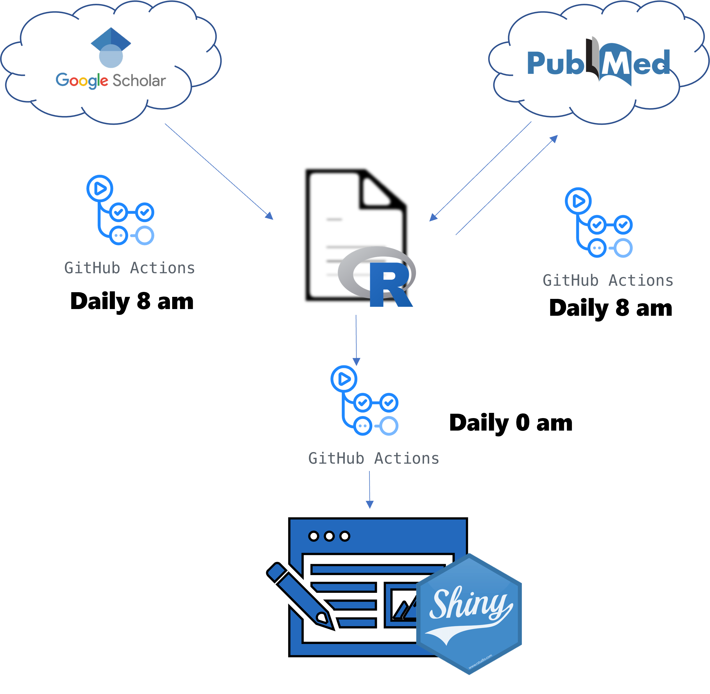

<!-- README.md is generated from README.Rmd. Please edit that file -->

```{r, include = FALSE}
knitr::opts_chunk$set(
  collapse = TRUE,
  comment = "#>"
)
```

# About

<!-- badges: start -->

<!-- badges: end -->

The goal of @marceerfDashboard is to submit a technical and scientific CV/Portfolio in shiny app format.


